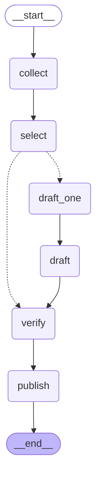
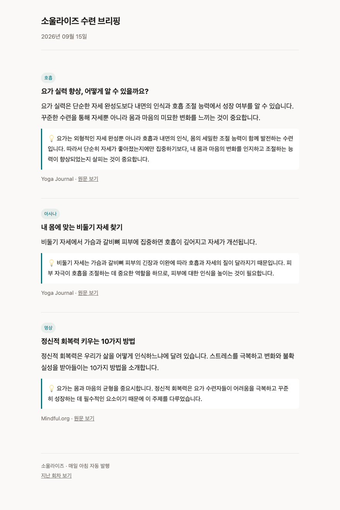

# 소울라이즈 수련 브리핑 — 프로젝트 수행 결과 보고서

모두의연구소 AIFFEL 「AI 에이전트 1기」 · 뉴스레터 에이전트 프로젝트
2026-09-15 · [저장소](https://github.com/soulairise/newsletter-agent) · [발행 페이지](https://soulairise.github.io/newsletter-agent/yoga/)

---

## 1. 분야 및 독자 정의

### 왜 요가·명상인가

저는 요가원을 운영하고 원광디지털대 요가명상학과 총학생회를 맡고 있습니다.
수업을 준비할 때마다 자료를 찾는데, **영문 요가 매체는 좋은 글이 많지만 매일 들어가 보기 어렵고
국내 매체는 수련 콘텐츠가 드물다**는 문제가 있었습니다.

AI 뉴스로 먼저 만들어 본 뒤 같은 구조를 제 분야로 옮겼습니다.
`audience.yaml` 에 프로필을 하나 더 적는 것으로 분야를 바꿀 수 있게 설계했습니다.

### 타깃 독자 페르소나

> **요가를 가르치거나 꾸준히 수련하는 사람.**
> 주 3회 이상 수련하고, 수업을 준비하며 새로운 시퀀스나 근거를 찾는다.
> 자세의 이름만이 아니라 **왜 그렇게 하는지**를 알고 싶어 한다.
> 아침에 5분 안에 훑고, 필요한 것만 저장해 둔다.

### 중요도 기준과 제외 조건

`audience.yaml` 에 문장으로 적었고, 그대로 선별·취재 프롬프트에 들어갑니다.

```yaml
focus: >-
  요가와 명상 수련 — 아래 중 하나라도 해당하면 적합하다:
  아사나(자세) 설명이나 시퀀스, 호흡법, 명상 방법과 태도,
  마음챙김 실천, 요가 해부학과 부상 예방,
  수련이 몸과 마음에 미치는 영향을 다룬 연구, 수련자의 경험과 통찰
exclude: >-
  특정 종교의 교리·종단 소식·법회·사찰 행사·종교 인물 기사와
  일반 건강·다이어트·제품 홍보 기사는
```

**처음에는 `focus` 에 "불교"를 넣었습니다.** 그랬더니 발행물이 종단 소식과 사찰 행사로 채워졌습니다.
요가·명상 실천만 남기려고 기준을 좁히고, 그 기준으로 소스를 다시 쟀습니다(§2).

---

## 2. 소스 채택표

### 채택 기준 — 네 개의 관문

교안이 제시한 세 관문에 **G4를 직접 추가**했습니다.

| 관문 | 묻는 것 | 재는 법 |
|---|---|---|
| G1 본문 | 요약할 재료가 나오는가 | 원문 추출 후 600자 이상인가 |
| G2 생존 | 최근에도 글이 올라오는가 | 최신 글이 30일 이내인가 |
| G3 접근 | 자동 수집이 허용되는가 | `robots.txt` 의 `can_fetch` |
| **G4 적합** | **우리 주제의 글을 실제로 쓰는가** | **최근 제목 20건의 주제 적중률 ≥ 30%** |

**G4를 만든 이유**: G1~G3는 "가져올 수 있는가"만 묻습니다. 불교 매체 3곳은 셋 다 통과했지만
(매일 글이 올라오고, 요약도 길고, robots도 허용) 실제 내용은 종단 소식이었습니다.
`gate_g4.py` 는 **선별 노드와 같은 기준**으로 제목을 판정시켜 적중률을 냅니다 —
키워드 매칭이 아니라 같은 기준을 써야 실제 동작을 예측합니다.

### 측정 결과 — 요가 프로필 (후보 18곳)

| 소스 | G2 최신글 | G3 robots | **G4 적중률** | 판정 |
|---|---|---|---|---|
| **Yoga Journal** | 0일 | 허용 | **50%** | ✅ 채택 |
| **Mindful.org** | 0일 | 허용 | **40%** | ✅ 채택 |
| **Yoga Medicine** | 4일 | 허용 | **40%** | ✅ 채택 |
| Tricycle | 0일 | 허용 | **0%** | ❌ 주제 불일치 |
| Lion's Roar | 12일 | 허용 | 20% | ❌ 주제 불일치 |
| 불교신문 기획 | 0일 | 허용 | 15% | ❌ 주제 불일치 |
| 현대불교 신행 | 0일 | 허용 | 15% | ❌ 주제 불일치 |
| 불교신문(전체) · 법보신문 | 0일 | 허용 | 10% | ❌ 주제 불일치 |
| 불교닷컴 · 현대불교(전체) | 0일 | 허용 | 25% | ❌ 주제 불일치 |
| 마음건강 길 | 0일 | 허용 | 10% | ❌ 건강 일반지 |
| Arhanta Yoga | 3일 | 허용 | 10% | ❌ 주제 불일치 |
| Greater Good | 0일 | 허용 | 5% | ❌ 심리 일반 |
| ScienceDaily | 0일 | 허용 | 5% | ❌ 과학 일반 |
| Yoga Basics | **35일** | — | — | ❌ G2 탈락 |
| DoYou | **201일** | — | — | ❌ G2 탈락 |
| Yogapedia | **2,163일** | — | — | ❌ G2 탈락 |
| Yoga International · EkhartYoga · Yoga U · Headspace · Calm · Sonima | — | — | — | ❌ 피드 없음 |

**18곳 중 3곳만 남았습니다.** 요가·명상 분야는 RSS를 내는 매체 자체가 드물고,
있어도 대부분 갱신이 멈춰 있었습니다. 교안 3강의 사다리로 말하면
**2칸(RSS)에 매체가 거의 없는 분야**입니다.

### 예상이 빗나간 두 사례

**① 「수행·신행」 섹션이 탈락(20%)했습니다.** 이름만 보면 가장 적합해 보였는데,
오히려 **「기획연재」가 35%** 로 높았습니다. 연재물이 수행·경전 해설 위주였기 때문입니다.
섹션 이름으로 고르면 틀립니다.

**② 「마음건강 길」이 10%** 였습니다. 이름이 딱 맞아 보였지만 건강·의학 일반지였습니다.

### 측정의 한계

표본이 10~20건이라 **기준선(30%) 근처의 소스는 다시 재면 판정이 뒤집힐 수 있습니다.**
실제로 Tricycle은 기준을 바꾸기 전 측정에서 20% → 30% 로 흔들렸습니다.
채택/탈락의 근거로는 쓸 만하지만 "A가 B보다 낫다"의 근거로는 약합니다.

### AI 프로필 (참고)

| 소스 | G4 | 소스 | G4 |
|---|---|---|---|
| HuggingFace | 90% | OpenAI | 65% |
| DeepMind | 85% | The Verge | 60% |
| AI타임스 | 80% | TechCrunch | 45% |
| Hacker News | 75% | 전자신문 | 30% |

전자신문은 AI 전용 섹션이 없어(901 오늘의뉴스·902 속보·903 인기·904 추천 모두 종합)
기준선에 턱걸이합니다. 국내 AI 소식의 주요 경로라 유지하되 한계를 기록해 둡니다.

---

## 3. 선별 로직 설계

### 왜 2단계인가 — 네 구조를 비교했습니다

| 구조 | 장점 | 버린 이유 |
|---|---|---|
| ① 독립 채점 후 상위 N | 절대 기준, 병렬 자유 | **동점 몰림** — 12건에 점수 값이 5개뿐이라 경계에서 자를 근거가 없음 |
| ② 토너먼트 (쌍대 비교) | 판정 질 높음, 동점 없음 | 100건이면 호출 수백 번 |
| ③ 한 번에 전부 비교 | 호출 1회, 상대 판단 | 후보가 늘면 중간을 흘림 |
| **④ 예선 → 본선** | ③의 장점 + 길이 문제 해결 | **채택** |

우리가 답해야 하는 질문은 **"이 기사가 몇 점인가"가 아니라 "오늘 것 중 위에서 다섯 번째까지가 무엇인가"** 입니다.
출력 개수가 고정된 정렬 문제이지 채점 문제가 아닙니다. 그래서 상대평가를 씁니다.

### 중요도 판단 문장

선별 프롬프트는 `audience.yaml` 의 값을 조립해 만듭니다.

```
당신은 {reader}을 위한 뉴스레터 편집자입니다.
이 중 중요한 {N}건을 고르세요.
반드시 {focus}의 기사만 고르세요.
{exclude} 제외하세요.
같은 사건을 다룬 기사는 하나만 고르고, event 라벨을 같게 붙이세요.
홍보·채용공고·행사안내는 고르지 마세요.
```

### 묶음(Batch) 크기를 20으로 정한 이유

| 값 | 근거 |
|---|---|
| **묶음 20건** | 모델이 한 화면에서 흘리지 않고 볼 수 있는 크기. 40건을 넘기면 중간이 누락되기 시작한다 |
| **묶음당 8건 통과** | 최종 5건보다 넉넉히 남긴다. 예선은 묶음 간 비교가 없어 **강한 기사가 한 묶음에 몰리면 손해**를 본다(묶음 운). 통과 수를 늘려 그 손실을 줄인다 |
| **1차 소스 상한 3건** | 면제만으로 자리가 다 차지 않게. 요가 프로필에는 1차 소스를 두지 않았다 — 잡지는 당사자 발표가 아니다 |
| **매체 상한 2건** | 한 매체가 5건 중 3건을 차지한 실행이 있었다. 코드로 강제 |

예선은 Anthropic의 **병렬화(sectioning)** 패턴입니다. 묶음끼리 서로 모르는 채로 처리되므로
묶음을 몇 개로 나누든 코드가 같고, 하나가 실패해도 나머지는 살아남습니다.

### 프롬프트로 안 되는 것은 코드로 셉니다

프롬프트에 "같은 사건은 하나만"이라고 적어도 지켜지지 않는 경우가 있었습니다.
**프롬프트는 요청이지 보장이 아닙니다.** 그래서 지켜야 하는 규칙은 코드로 옮겼습니다.

| 규칙 | 구현 |
|---|---|
| 같은 사건 중복 제거 | 본선 결과의 `event` 라벨을 세어 중복이면 건너뜀 |
| 매체 상한 | `source` 별 카운트로 강제 |
| topic 값 제한 | `audience.yaml` 의 목록과 대조해 벗어나면 첫 값으로 |
| 한국어 출력 | `re.search(r"[가-힣]")` 로 검사 후 재요청 |

---

## 4. 파이프라인 구조도

`graph.py` 에서 `get_graph().draw_mermaid()` 로 뽑은 **실제 구조**입니다.



점선이 조건부 엣지입니다. `select` 뒤가 **팬아웃 경계**입니다 —
그 앞은 모아서 한 번에(중복 판정·상대평가·상한), 그 뒤는 건별로 나뉩니다(본문 추출·요약).

### State 설계

```python
class NewsState(TypedDict):
    hours:     int                                   # 수집 시간 창 (설정값)
    collected: list[dict]                            # ① 수집      덮어쓰기
    picked:    list[dict]                            # ② 선별      덮어쓰기
    drafted:   Annotated[list[dict], operator.add]   # ③ 취재      합침 (팬아웃)
    verified:  list[dict]                            # ④ 검수      덮어쓰기
    log:       Annotated[list[str], operator.add]    #  전 노드     합침
```

**리듀서는 합쳐야 하는 키에만 붙였습니다.** `drafted` 는 여러 취재 워커가 동시에 쓰고,
`log` 는 모든 노드가 한 줄씩 남깁니다. 반면 `collected`·`picked` 는 한 노드가 쓰고 다음이 읽으므로
덮어쓰기가 맞습니다. 여기에 리듀서를 붙이면 **선별이 9건을 5건으로 줄였는데 결과가 14건이 됩니다.**

검수는 반대로 **줄이는** 일을 합니다. `drafted` 에 리듀서가 붙어 있어 통과분만 돌려주면 늘어나므로,
`verified` 라는 새 키에 담았습니다 — 합치는 키와 줄이는 키를 나눈 것입니다.

### 노드별 책임

| 노드 | 하는 일 | 핵심 설계 |
|---|---|---|
| `collect` | RSS 수집 · 시간 창 · 중복 제거 · 소스 상한 | 소스 하나가 죽어도 나머지는 모으고, **죽은 곳을 로그에 남긴다** |
| `select` | 예선(묶음) → 본선 | 구조화 출력으로 형식 강제, `event` 라벨로 중복 제거 |
| `draft_one` | 본문 추출 + 3칸 요약 | `Send` 로 기사 수만큼 팬아웃. 워커는 자기 기사만 안다 |
| `verify` | 요약과 원문 대조 | `headline`·`summary` 만 대상, `why` 는 제외 |
| `publish` | 디스코드 + 웹 발행 | `DRY_RUN` 기본값은 **보내지 않음** |

---

## 5. 실행 기록

### 디스코드 발행 (2026-09-15 12:15)

발행자 **소울라이즈 수련 브리핑**, 검수 3/3 합격, HTTP 204.

```
1. 요가 실력 향상, 어떻게 알 수 있을까요?      Yoga Journal · 호흡
2. 내 몸에 맞는 비둘기 자세 찾기                Yoga Journal · 아사나
3. 정신적 회복력 키우는 10가지 방법             Mindful.org · 명상
```

### 웹 발행



고정 주소 <https://soulairise.github.io/newsletter-agent/yoga/> 의 내용을 매일 갈아 끼웁니다.
회차는 `docs/yoga/YYYY-MM-DD.html` 에 남습니다.

### 파이프라인 로그

```
① 수집 전체 25 → 창(336h) 16 → 중복 -0 → 기발행 -9 → 소스상한 적용 → 후보 7건
② 예선 통과 4건 (1차 소스 자동통과 0건 포함)
② 본선 → 3건
③ 취재 3건
④ 검수 3/3건 합격
⑤ 발행 3건 전송 · HTTP 204
   ⑤-1 웹 docs/yoga/index.html · 회차 2건 보관
```

`기발행 -9` 가 발행 이력이 작동한 흔적입니다. 창이 14일이라
같은 기사가 계속 후보로 올라오는데, 이미 보낸 것은 제외됩니다.

### 자동 실행

`.github/workflows/daily.yml` — 매일 **07:00 KST**(22:00 UTC).
예약 실행은 `yoga` → `ai` 를 차례로 발행하고, 결과 페이지를 커밋합니다.

실행 지표는 `store/metrics.jsonl` 에 한 줄씩 쌓입니다.

```json
{"at":"2026-09-15T02:56:...","profile":"yoga","collected":10,"picked":3,
 "drafted":3,"verified":3,"verify_fail":0,"sources":["Mindful.org","Yoga Journal"],"dry_run":false}
```

### 검수가 실제로 걸러낸 사례

```
✗ 불합격: AI 산업의 최신 종말 경고 —
   '일부 연구자들은 AI가 인류를 멸망시킬 가능성을 10% 이상으로 추정' 이
   원문에서 뒷받침되지 않음

✗ 불합격: Lyft, 내슈빌서 웨이모 로보택시 서비스 시작 —
   '상업용 무인택시 서비스에 본격 진출했다' 는 주장이 원문에 없음
```

문장은 매끄러웠습니다. **매끄러운 것과 정확한 것은 다릅니다.**

### 검수 실패 시의 처리

불합격한 요약은 **버리고 로그에 남깁니다. 다시 쓰지 않습니다.**
세 가지 선택지 중 이것을 고른 이유는 발행 규칙을 단순하게 잡았기 때문입니다 —
**검수를 통과한 만큼 그대로 보냅니다.** 다섯 건을 채우려고 재작성하거나 다시 긁어 오지 않습니다.

되돌아가는 경로를 붙이면 '언제까지 다시 시도할 것인가'를 정해야 하고,
거기서부터 재시도 횟수·비용 상한·중복 누적이 줄줄이 따라옵니다.
**서비스는 중단되지 않습니다** — 3건이면 3건, 0건이면 "오늘은 조용합니다" 한 장이 나갑니다.

---

## 6. 프로젝트 회고

### 가장 공들인 부분 — 결함을 숫자로 찾아낸 일

**중복 제거가 기사를 통째로 삼키고 있었습니다.**

```python
key = link.split("?")[0]     # utm 꼬리표를 떼려는 의도
```

국내 언론사는 기사 번호를 쿼리에 넣습니다(`?idxno=442281`). `?` 뒤를 자르면
**50건이 전부 같은 주소**가 됩니다.

| 소스 | 실제 기사 | 고유로 인식된 수 |
|---|---|---|
| 불교신문 | 50 | **1** |
| 법보신문 | 50 | **1** |
| 현대불교 | 50 | **1** |
| **AI타임스** | 50 | **1** |

**에러도 없고 파이프라인은 매일 성공으로 끝났습니다.** 건수가 줄었다는 것 말고 단서가 없었습니다.
교안이 말한 **조용한 실패**의 교과서적 사례입니다.
추적 파라미터만 골라 제거하도록 고치자 요가 후보 22 → 94건, AI타임스 1 → 50건이 회복됐습니다.

**그리고 제 검사 도구에도 같은 병이 있었습니다.** G3(robots.txt) 관문이 OpenAI를 차단으로 판정했는데,
확인해 보니 `robots.txt` 는 `Allow: /` 였습니다. `RobotFileParser` 가 파이썬 기본 UA로 403을 받고
그걸 "전부 금지"로 해석한 것이었습니다. **검사 장치가 멀쩡한 소스를 조용히 버리고 있었습니다.**

### 배운 것 — 프롬프트의 나열은 AND로도 읽힙니다

`focus` 에 "…해부학·**과학 연구**"라고 나열했더니 모델이 그것을 **필수 조건**으로 읽고
실제 수련법 기사를 떨어뜨렸습니다.

```
− 탈락: 15-Minute Seated Yoga Practice — 실제 수련 안내로 과학 연구 내용이 아님
```

**"아래 중 하나라도 해당하면 적합"** 이라고 못 박아 고쳤습니다.
같은 교훈을 스키마에서도 만났습니다 — `topic` 필드 설명에 "다섯 중 하나"라고 적었는데
`"AI, 소프트웨어 개발, 시스템 운영, GPT-6 Astra"` 가 들어왔습니다.
**스키마가 보장하는 건 칸이 채워진다는 것이지 내용이 지시를 지켰다는 게 아닙니다.**

### 로컬에서 되는 것과 자동 실행은 다릅니다

자동 실행이 요가가 아니라 AI를 발행했습니다. 워크플로에 `NEWSLETTER_PROFILE` 을 넘기지 않아
기본값이 적용된 것입니다. 로컬에서는 매번 앞에 붙여 돌렸던 터라 **로컬에서만 맞고 자동 실행은 틀린**
상태였고, 아침에 결과를 보고서야 알았습니다.

### 향후 보완하고 싶은 것

| 순위 | 항목 | 이유 |
|---|---|---|
| 1 | **국내 소스 확보** | 지금은 발행물이 전부 영문 원문이다. 국내 요가·명상 매체 중 RSS를 내는 곳을 더 찾거나, 없으면 사다리 5칸(스크래핑)을 검토해야 한다 |
| 2 | **본선에 본문 일부 제공** | 선별이 제목과 RSS 요약(평균 280자)만 보고 판단한다. 좋은 글이 제목이 밋밋해서 떨어질 수 있다 |
| 3 | **검수 장치의 고장 탐지** | 검수는 평소에 아무 일도 안 하다가 고장 나도 티가 안 난다. 일부러 틀린 요약을 흘려보내 잡히는지 확인하는 검사를 넣어야 한다 |
| 4 | **카카오톡 채널 발행** | 디스코드를 쓰지 않는 회원에게 닿지 않는다. 사업자 채널로 브랜드 메시지(F 타입) 연동을 준비 중이다 |
| 5 | **소스 상한을 비율로** | 지금은 고정값(25건)이라 소스가 늘면 다시 조정해야 한다 |

### 이 실험이 증명하지 않은 것

- **G4 적중률은 표본 10~20건의 값입니다.** 기준선 근처는 재측정에서 뒤집힐 수 있습니다.
- **요가 소스가 3곳뿐입니다.** 어느 한 곳이 멈추면 발행이 크게 줄어듭니다.
- 검수도 언어 모델이라 틀립니다. **검수를 붙였다고 정확성이 보장되는 게 아니라 틀릴 확률이 줄어드는 것**이고,
  그 차이를 혼동하면 검수를 믿고 다른 안전장치를 빼게 됩니다.
